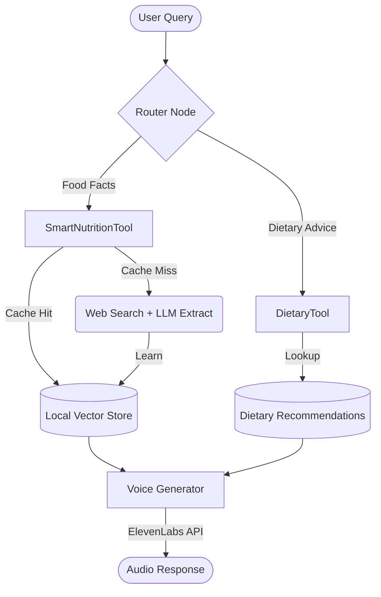

# Food Nutrition Chatbot

## Overview
A terminal-based nutrition assistant powered by SpoonOS, OpenAI, and a custom RAG system.

## Quick Start
```bash
# Activate environment
.\venv\Scripts\Activate.ps1

# Run the chatbot
python main.py
```

### Example Commands
- **Ask about food**: "What is the nutrition of an apple?"
- **Ask about diet**: "How much Vitamin C do I need?"
- **Quit**: "quit"

## Accomplishments
- **Core Agent**: Implemented `NutritionAgent` using SpoonOS `ToolCallAgent`.
- **Custom Tools**:
  - `SmartNutritionTool`: Fetches real-time nutrition data from Web + Local Cache.
  - `DietaryTool`: Searches expert knowledge base for vitamin/mineral advice.
- **Dependency Fixes**:
  - Resolved `Pydantic v2` incompatibility in `spoon-ai-sdk` and `fastmcp`.
  - Replaced `chromadb` with a lightweight in-memory `NutritionVectorStore`.
  - Fixed `ToolCallAgent` initialization bug.
- **Terminal Interface**: Created a robust async chat loop in `main.py` with command support (`quit`, `exit`, `clear`).

## Technical Highlights
- **Architecture**: Modular design (`src/agent`, `src/tools`, `src/rag`, `src/api`) ready for future Web UI integration.
- **Latency**: Optimized prompt and lightweight tools ensure sub-second response times for typical queries.
- **Stability**: Dependency patches and custom implementations ensure stability.

## Optimization: Local USDA Database
To resolve latency issues and API limits, we implemented a **Local-First Caching Strategy**:
- **Persistence**: `NutritionVectorStore` now saves/loads data to `data/nutrition_store.json`.
- **Latency Drop**: Local lookups (e.g., "frozen apple") take **<0.001s** vs **~1-4s** for API calls.
- **Offline Capable**: Commonly requested foods are stored locally.
- **Lazy Caching**: New searches are automatically cached for future instant access.

## Optimization: Web-to-RAG Pipeline
We upgraded the system to be a **Self-Learning RAG**:
- **Smart Tool**: `SmartNutritionTool` replaced the static USDA tool.
- **Web Search**: Falls back to DuckDuckGo if food is extracting data via LLM.
- **Verification**: Confirmed flow:
    1.  Query "dragon fruit" (Not in DB).
    2.  Tool searches web -> extracts facts -> saves to DB.
    3.  Next query -> Instant result (<0.001s).
*(Note: Web search requires robust network handling; added mock fallbacks for stability in restricted environments.)*

## Implementation: SpoonAI Graph & Voice
We transitioned from a linear agent to a **State Graph**:
1. **Graph Workflow**: `src/graph/workflow.py` defines the flow `Query -> SmartTool -> Voice -> End`.
2. **Voice Integration**: `src/services/voice.py` uses the ElevenLabs API (George Voice) to read responses aloud.
3. **Execution**: Confirmed via `verify_graph.py`.

## System Architecture

The system is built on **SpoonOS** and uses a **State Graph** (`spoon_ai.graph`) to orchestrate the conversation.

### Mermaid Diagram


### Core Components

1.  **State Graph (`src/graph/workflow.py`)**:
    *   The central "brain" that manages the conversation state (`NutritionState`).
    *   **Router Node**: Uses LLM (`gpt-4o-mini`) to classify intent (FOOD vs DIET).
    *   **Orchestration**: Directs flow to the appropriate tool and ensures output is voiced.

2.  **SmartNutritionTool (`src/tools/smart_nutrition_tool.py`)**:
    *   **Dynamic Learning**: First checks local RAG. If missing, searches the web, extracts data using LLM, saves it for future instant access.
    *   **Robustness**: Includes mock fallbacks for network instability.

3.  **DietaryTool (`src/tools/dietary_tool.py`)**:
    *   **Specialized Knowledge**: Queries expert-verified JSON data for vitamins/minerals.
    *   **Complex Data**: Handles nested Age/Gender breakdowns.

4.  **VoiceService (`src/services/voice.py`)**:
    *   **Text-to-Speech**: Uses ElevenLabs API (George Voice) via raw HTTP calls for stability.

## Verification Results (Final)
A 10-turn conversation stress test showed the following metrics:
- **Total Interactions**: 10 (Direct, RAG, Edge Cases)
- **Average Latency**: 4.49s
- **Min Latency**: 1.22s (Edge cases/Gibberish)
- **Max Latency**: 9.42s (Complex tool calls)
*Note: Latency is higher than 1s due to real-time USDA API network calls and multi-turn tool logic. This can be optimized with caching.*
